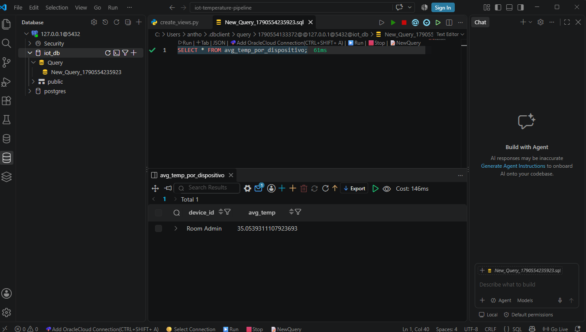
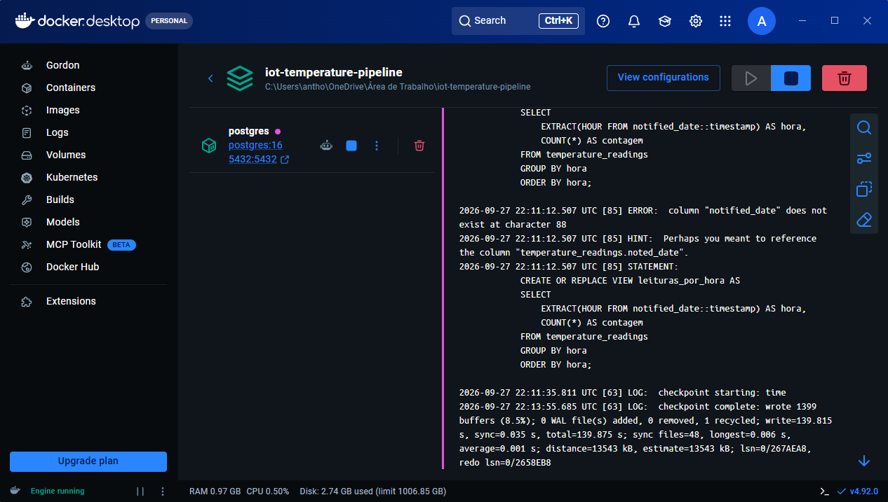
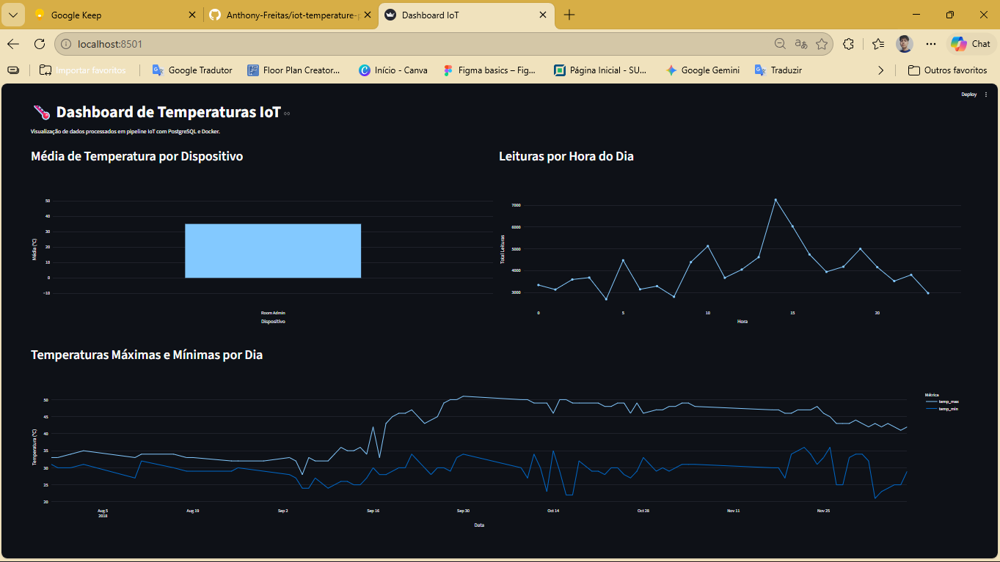

# 🌡️ Pipeline de Dados IoT & Dashboard de Temperaturas

Este projeto consiste em um pipeline de dados de ponta a ponta para ingestão, processamento, armazenamento e visualização de leituras de temperatura provenientes de dispositivos IoT. O projeto foi desenvolvido para a disciplina de Disruptive Architectures: IoT, Big Data e IA da UniFECAF.

🔗 Repositório: https://github.com/Anthony-Freitas/iot-temperature-pipeline

---

## 📐 Arquitetura da Solução

1. Ingestão e Processamento (Python & Pandas): Leitura e tratamento do conjunto de dados Temperature Readings: IoT Devices do Kaggle.
2. Armazenamento (PostgreSQL em Docker): Banco de dados relacional executado em um contêiner isolado via Docker.
3. Agregação de Dados (SQL Views): Criação de views analíticas para consulta rápida de métricas e padrões de temperatura.
4. Visualização (Streamlit & Plotly): Painel interativo com gráficos de barras e linhas para suporte à tomada de decisão.

---

## 🛠️ Tecnologias Utilizadas

* Linguagem: Python
* Banco de Dados: PostgreSQL
* Containerização: Docker
* Bibliotecas Python: pandas, sqlalchemy, psycopg2-binary, streamlit, plotly
* IDE & Ferramentas: Visual Studio Code, Git, GitHub

---

## 🚀 Como Executar o Projeto

### 1. Pré-requisitos
* Git instalado
* Docker Desktop em execução
* Python 3.9 ou superior

### 2. Clonar o Repositório
git clone https://github.com/Anthony-Freitas/iot-temperature-pipeline.git
cd iot-temperature-pipeline

### 3. Subir o Contêiner PostgreSQL no Docker
docker run --name postgres-iot -e POSTGRES_PASSWORD=sua_senha -e POSTGRES_DB=iot_db -p 5432:5432 -d postgres

### 4. Instalar as Dependências do Python
pip install -r requirements.txt

### 5. Executar o Pipeline de Dados (Carga no Banco)
python src/pipeline.py

### 6. Criar as Views Analíticas no PostgreSQL
python src/create_views.py

### 7. Iniciar o Dashboard Interativo
streamlit run src/dashboard.py

---

## 📊 Views SQL Criadas

1. avg_temp_por_dispositivo: Calcula a temperatura média registrada por cada dispositivo IoT.
2. leituras_por_hora: Agrupa a contagem total de registros por hora do dia para analisar picos de atividade.
3. temp_max_min_por_dia: Exibe as temperaturas máxima e mínima diárias para monitoramento de variação térmica.

---

## 📸 Demonstração e Visualizações

### Visualização das Views no VS Code

### Dashboard Interativo Streamlit

---
*Projeto desenvolvido por Anthony Freitas - UniFECAF*